

  <h1> Open-Domain Question Answering </h1>
  
 MRC(기계독해), 주어진 지문을 이해하고, 주어진 질의의 답변을 추론하는 태스크

<table>
    <tr height="160px">
        <td align="center" width="150px">
            
             
            <strong>지은</strong>
        </td>
        <td align="center" width="150px">
            
             
            <strong>재연</strong>
        </td>
        <td align="center" width="150px">
            
             
            <strong>영준</strong>
        </td>
        <td align="center" width="150px">
            
             
            <strong>다혜</strong>
        </td>
            <td align="center" width="150px">
            
             
            <strong>윤진</strong>
        </td>
    </tr>
<table>

# 1. 프로젝트 개요

## 1.1 개요

**"서울의 GDP는 세계 몇 위야?", "MRC가 뭐야?"**

우리는 궁금한 것들이 생겼을 때, 아주 당연하게 검색엔진을 활용하여 검색을 합니다. 이런 검색엔진은 최근 기계독해 (MRC, Machine Reading Comprehension) 기술을 활용하며 매일 발전하고 있는데요. 본 대회에서는 우리가 당연하게 활용하던 검색엔진, 그것과 유사한 형태의 시스템을 만들어 볼 것입니다.

**Question Answering (QA)은 다양한 종류의 질문에 대해 대답하는 인공지능**을 만드는 연구 분야입니다.

다양한 QA 시스템 중, **Open-Domain Question Answering (ODQA) 은 주어지는 지문이 따로 존재하지 않고 사전에 구축되어있는 Knowledge resource 에서 질문에 대답할 수 있는 문서를 찾는** 과정이 추가되기 때문에 더 어려운 문제입니다.

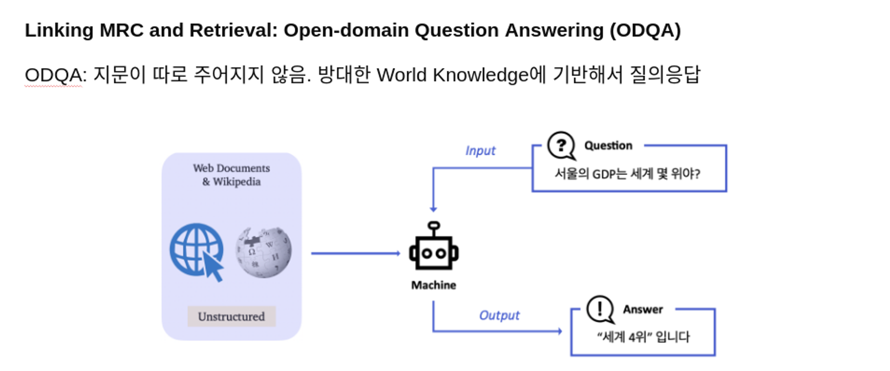

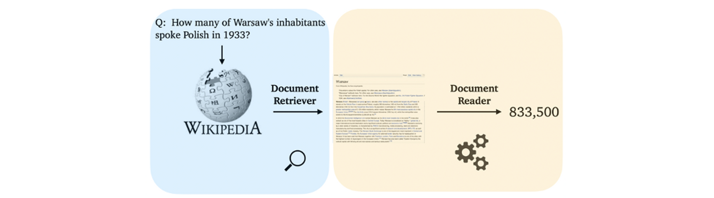

## 1.2 환경

**[팀 구성 및 컴퓨팅 환경]** 5인 1팀, 인당 V100 서버를 VScode 또는 JupyterLab에서 사용

**[협업 환경]** Notion, Github

**[의사소통]** 카카오톡, Zoom, Slack

# 2. 프로젝트 팀 구성 및 역할

- 권지은 - BM25+, 데이터 전처리, doc_stride 조정, DensePhrases, QA 데이터 증강
- 김재연 - DPR 학습 코드 제작 및 실험, 앙상블 - hard voting
- 박영준 - 토크나이저 변경, 모델 일반화, 외부데이터 증강
- 정다혜 - 외부데이터증강, 앙상블 - softvoting, doc_score 적용방법 탐색
- 최윤진 - 일반 상식 데이터 추가 사전 학습, 엘라스틱 서치 검색, 커리큘럼 러닝

# 3. 프로젝트 수행 절차 및 방법

## 3.1 팀 목표 설정

- 리더보드의 점수보다는 모델의 성능에 집중한다.
- 실험은 가설 수립을 통해 진행하며 결과를 증명하고 분석한다.
- 모든 행동은 근거를 갖고 행동한다.
- 작업한 내용을 팀원들과 공유하며 해결책을 같이 찾아 나아간다.

## 3.2 타임라인

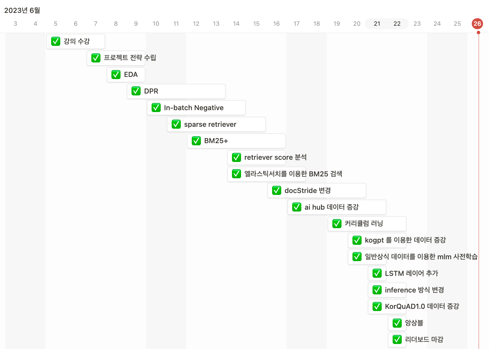

## 3.3 협업 문화

- 데일리스크럼과 피어 세션 때 각자의 진행 상황과 다음 실험 계획을 공유한다.
- 깃허브 이슈와 노션 페이지를 이용하여 작업 내용을 기록한다.
- PR을 통해 작업한 코드 리뷰를 진행한다.
- 공유할 내용은 바로 슬랙에 올리고, 이모지로 읽은 표시를 한다.

# 4. 프로젝트 수행 결과

## 4-1. 학습 데이터 소개

학습 데이터는 다음과 같이 구성되어있다.

target : answers

| index | title | context | question | id | answers | document_id | __index_level_0__ |
| --- | --- | --- | --- | --- | --- | --- | --- |
| 0 | 미국 상원 | 미국 상의원 또는 미국 상원(United States Senate)은 양원제인 미국... | 대통령을 포함한 미국의 행정부 견제권을 갖는 국가 기관은? | mrc-1-000067 | {'answer_start': [235], 'text': ['하원']} | 18293 | 42 |
| 1 | 인사조직관리 | '근대적 경영학' 또는 '고전적 경영학'에서 현대적 경영학으로 전환되는 시기는 19... | 현대적 인사조직관리의 시발점이 된 책은? | mrc-0-004397 | {'answer_start': [212], 'text': ['《경영의 실제》']} | 51638 | 2873 |

## 4-2. EDA

### 4-2-1 answer 길이

- train dateset의 answer 의 길이는 평균적으로 6.2로, 대체로 단답형 답변이 많았다.

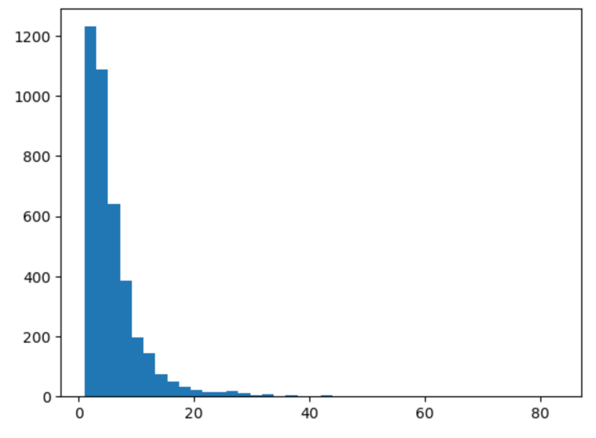
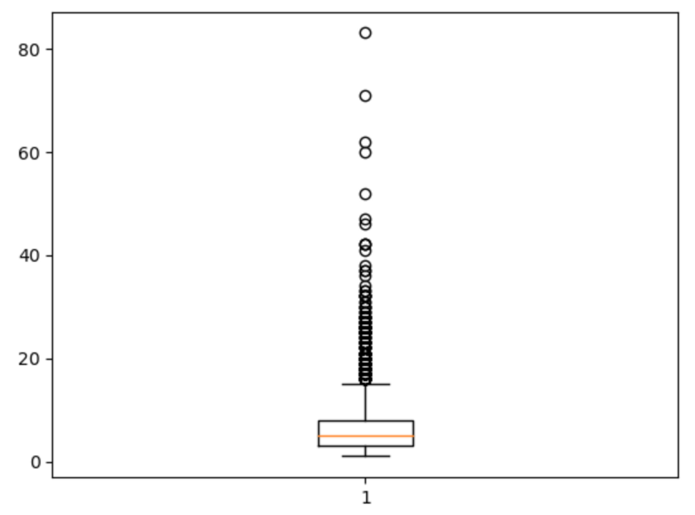
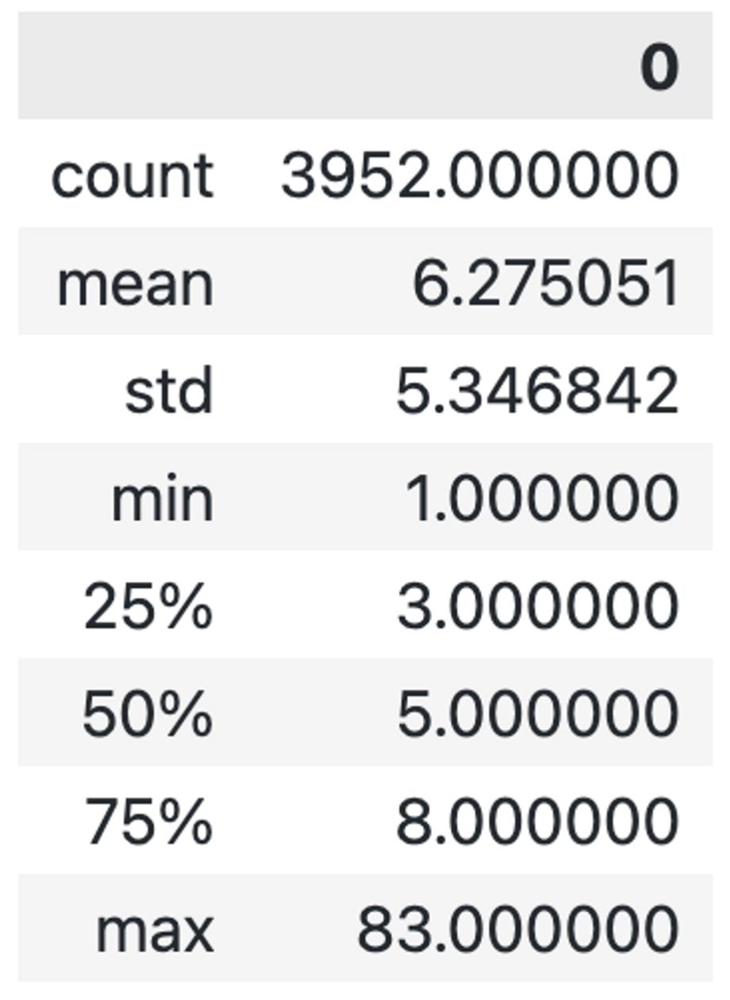

### 4-2-2 wiki data context 길이 분포 (TOP-10 제외)

- 전반적으로 1000이하의 분포임을 확인하였다.

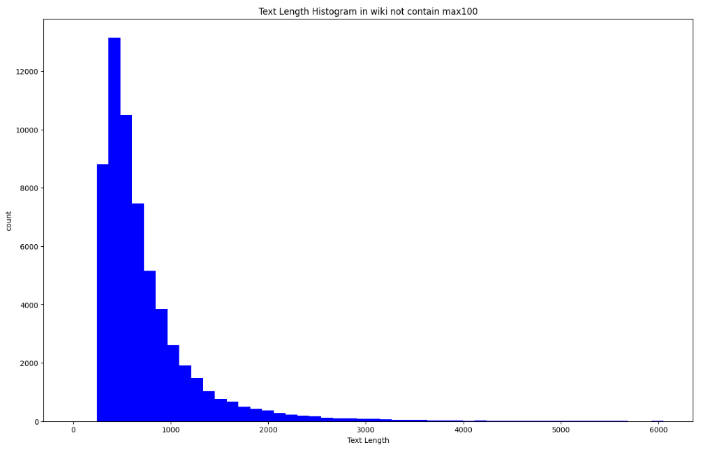

## 4-3. 전처리

### 4-3-1. 문자열 ‘\n’ 제거

- 가설: 문자열 ‘\n’은 ‘[UNK] n`으로 토큰화 되기 때문에 성능에 악영향을 끼친다.
- 실험 결과:
    
  
  |  | EM [private] | F1 [private] |
  | --- | --- | --- |
  | 제거 전 | 51.6700 | 64.9400 |
  | 문자열 \n 제거 | 56.1100 | 69.8000 |

## 4-4. 모델 선정

### 4-4-1. Retriever

- TF-IDF, BM25+, elastic search 를 이용한 BM25, DPR 을 테스트 하였고, 제일 성능이 좋게 나온 건 BM25+ 였다.
- 자체적으로 만든 retrival score 지수를 사용하였다. (주어진 첫 번째 term에 문서가 포함되면 가중치 1을, 두 번째 term에 포함되면 가중치 0.5를 적용한다. 이렇게 모든 문서에 대해 가중치를 적용한 뒤, 가중치의 합으로 나누어 정규화 하였다.)
    
    
  |  | retrival score |
  | --- | --- |
  | TF-IDF | 0.6078 |
  | BM25+ | 0.8549 |
  | DPR | 0.7826 |

  TF-IDF
    
  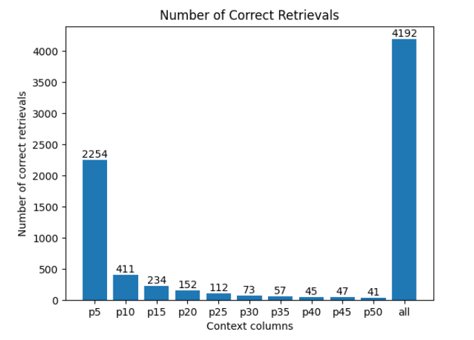

    
  BM25+
    
  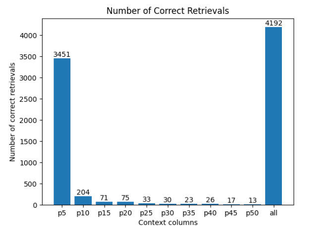

    
  DPR
    
  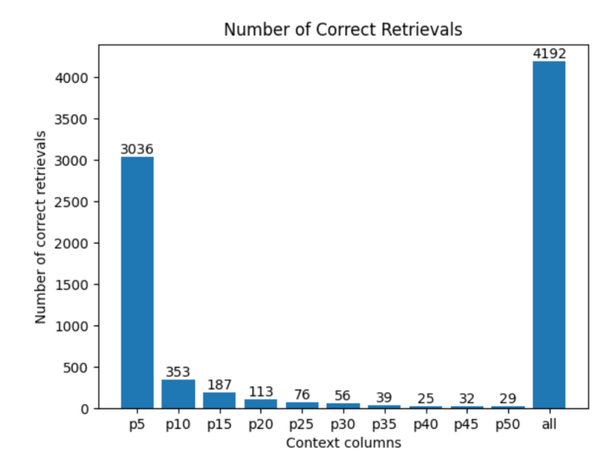
    
    
    

### 4-4-1-1. 엘라스틱 서치를 이용한 bm25 검색

- 가설 : 엘라스틱 서치가 bm25 알고리즘을 기본 검색 엔진[1]으로 사용하고 있기 때문에, passage 검색 시 엘라스틱 서치를 이용하면 될 것이다.
- 실험 : 도커에 엘라스틱 서치를 띄우고 학습 데이터를 json 형식으로 올린 다음, 엘라스틱 서치 검색을 통해 top 30 안에 ground truth 를 가져오는 비율을 테스트 해보았다.
- 실험 결과 : top 30 안에 ground truth 를 가져오는 비율이 기존 TF-IDF 를 이용하는 것에 비해  상당히 낮았다. k1, b 의 값을 튜닝하면서 찾아보았음에도 좋아지지 않았다. nori tokenizer 를 이용하였을 때 top5 안에 가져오는 비율이 조금 높아졌지만 top30 안에 가져오는 비율은 같았다.  엘라스틱 설정, 클러스터 상태에 따라 성능이 달아지는 것으로 판단된다.
    
    
  |  | top-30 안에 가져오는 ground-truth 비율  |
  | --- | --- |
  | 엘라스틱 서치 | 70/240 |
  | 엘라스틱 서치(nori tokenizer) | 70/240 |
  | TF-IDF | 192/240 |

### 4-4-2. Reader

- 다섯 가지 모델을 테스트 하였고, 제일 성능이 좋게 나온 건 klue/roberta-large 였다.
    
    
  | 모델 (top-k = 10) | EM [public → private] | F1 [public → private] |
  | --- | --- | --- |
  | klue/bert-base | 35.4200 → 34.4400 | 48.4100 → 47.3200 |
  | bert-base-multilingual-cased | 17.5000 → 21.3900 | 34.5700 → 37.6500 |
  |  sangrimlee/bert-base-multilingual-cased-korquad | 20.4200 → 25.5600 | 36.8200 → 41.5000 |
  | monologg/koelectra-base-v3-discriminator | 31.6700 → 33.3300 | 41.2600 → 43.2500 |
  | klue/roberta-large | 42.0800 → 40.2800 | 53.1700 → 53.1000 |

## 4-5. 모델 개선

### 4-5-1. Retriever

### 4-5-1-1. Retriever 토크나이저 변경

- 가설 : TFIDF와 BM25+의 토크나이저를 KoNLPy의 토크나이저로 바꾸면 형태소 단위로 나눠서 기존의 BERT-base 토크나이저보다 더 잘 분류해낼 것이다.
- 실험 : KoNLPy의 Okt 토크나이저를 사용하여 BM25+에 적용 후 자체적으로 만든 retrival score 지수를 통해 성능 비교
- 실험 결과 : 기존 Retriever와 크게 차이를 볼 수 없었고, 실험의 편의성을 위해 기존 BERT-base 토크나이저를 계속 사용하기로 함
    
  
  |  | retrival score |
  | --- | --- |
  | BERT-base 토크나이저 | 0.8549 |
  | KoNLPy Okt 토크나이저 | 0.8548 |

### 4-5-1-2. DPR loss function 수정

- 가설 : DPR을 학습 시킬 때 hard example과 in-batch negative sampling을 함께 활용하였는데, hard example은 기존 passage와 임베딩이 비슷할 것이므로 hard example의 loss에 가중치를 주면 hard example에 대한 학습이 더 잘 될 것이다.
- 실험 : in-batch negative의 개수만큼 hard example에 가중치를 주어 학습시킨다.
- 실험 결과 : 기존 방법보다 retrieval 성능이 향상 된 것을 확인할 수 있었다.

|  | retrival score |
| --- | --- |
| 기존 Loss | 0.7004 |
| 가중치 준 Loss | 0.7826 |

### 4-5-2. Reader

### 4-5-2-1. 일반 상식 데이터를 mlm 마스킹 추가 사전 학습

- 가설 : 모델에 위키 백과 데이터로 이루어진 일반 상식 데이터를 마스킹 사전 학습을 하게 되면 reader 성능이 올라갈 것이다.
- 실험 : roberta 가 사전 학습한 마스킹 처리 방식을 유지하기 위해, DataCollatorForLanguageModeling 라이브러리를 이용하여 증강 데이터를 마스킹 처리 후 그것을 복원하는 방식으로 roberta 를 추가 사전학습을 시켰다.
- 실험 결과 : 68000개, 20000개 의 데이터를 각각 추가 사전 학습시켜 보았지만 성능 향상은 없었다.
    
    
  |  | EM [validation] | F1 [validation] |
  | --- | --- | --- |
  | 일반 상식 68000개 마스킹 학습 | 60.833 | 67.965 |
  | 일반 상식 20000개 마스킹 학습 | 64.583 | 72.699 |
  | 추가 학습 하지 않은 모델 | 69.583 | 76.404 |

EM

 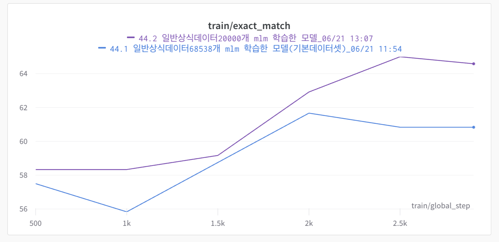

F1
 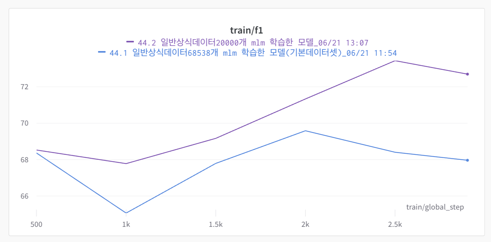

### 4-5-2-2. 레이어 추가

- 가설 : 기존 모델에 레이어를 추가하면 reader 의 성능이 더 좋아질 것이다.
- 실험 : LSTM, GRU, BiLSTM, BIGRU 레이어를 모델에 추가하여 실험하였다.
- 실험 결과 : 학습 데이터가 4000 개 밖에 되지 않아서 오히려 오버피팅이 되어 성능 하락을 한 거 같다.
    
    
    |  | EM [validation] | F1 [validation] |
    | --- | --- | --- |
    | lstm 레이어 추가 | 68.333 | 74.631 |
    | gru 레이어 추가 | 62.500 | 70.427 |
    | bilstm 레이어 추가 | 66.667 | 74.631 |
    | bigru 레이어 추가 | 64.583 | 73.625 |
    | 레이어 미추가 | 69.583 | 76.406 |

EM

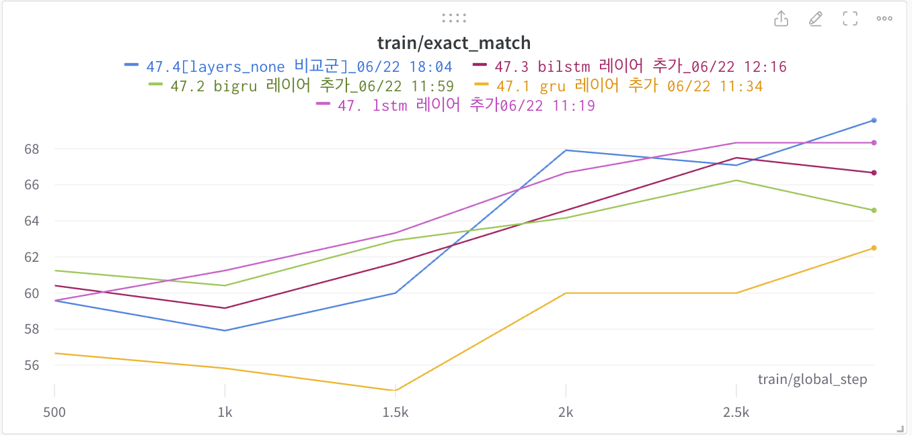

F1

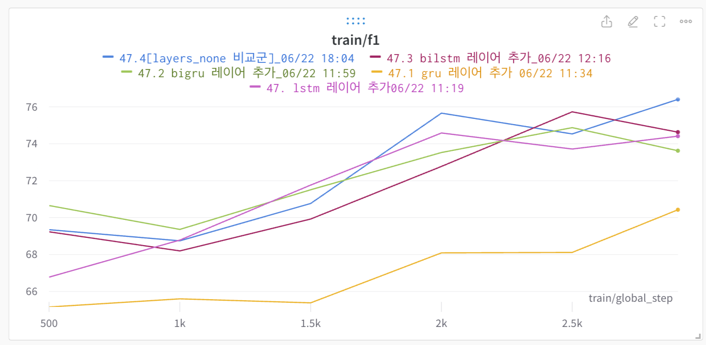

### 4-5-2-3. 커리큘럼 러닝

- 가설 : 데이터셋의 순서를 바꾸어서 쉬운 문제부터 어려운 문제로 모델이 단계적으로 데이터 셋을 구성하게 되면 모델이 학습을 더 잘 하게 될 것이다.
- 실험 결과 : 답변의 길이가 짧은 순, 질문의 길이가 짧은 순, 육하원칙 질문 부터 학습 시키는 방식으로 실험을 해보았지만 유의미한 성능 향상은 없었다.
    
    
    |  | EM [validation] | F1 [validation] |
    | --- | --- | --- |
    | 기본 데이터 셋 | 69.583 | 76.406 |
    | 답변의 길이가 짧은 순 | 65.833 | 75.240 |
    | context 길이가 짧은 순 | 65.000 | 71.864 |
    | 질문의 길이가 짧은 순 | 63.333 | 71.321 |
    | 육하원칙 질문 부터 학습 | 65.833 | 74.077 |

EM

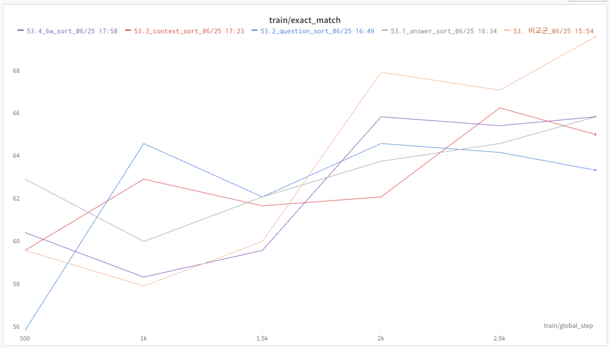

F1

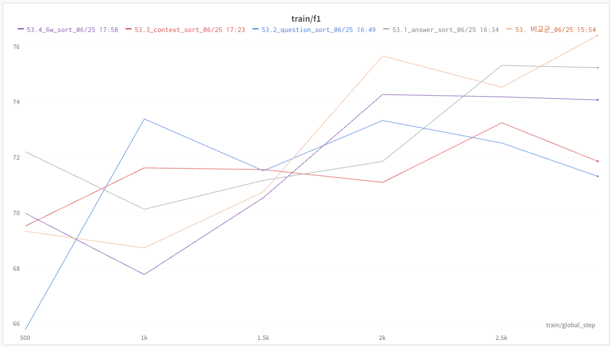

### 4-5-2-4. doc_stride 조정

- 가설: 답의 길이가 길지 않아서 doc_stride를 줄여도 성능에 차이 없이 더 빠른 추론을 할 수 있을 것이다.
- 실험: doc_stride: [128, 64, 32, 16, 8], max_sequence_length: [234, 334, 384, 424, 477, 571] 조합 중 valid 점수가 가장 높은 두 경우를 제출해서 점수를 확인
- 실험 결과: doc_stride를 줄였더니 성능이 올라갔다.
    
  | (doc_stride, max_sequence_length) | EM [private] | F1 [private] |
  | --- | --- | --- |
  | 기존 (128, 384) | 56.1100 | 69.8000 |
  | (8, 384) | 58.8900 | 69.6300 |
  | (128, 477) | 56.3900 | 69.1100 |

### 4-5-2-5. reader 학습데이터에 비슷한 context를 같이 넣어서 학습

- 가설 : reader가 실제 예측을 할 때에는 Retriever를 통해 query와 비슷한 context 여러개에서 예측을 하기 때문에 학습 시에도 비슷하게 학습을 하면 성능이 향상될 것이다.
- 실험 : BM25+ Retriever를 통해 학습 데이터의 query와 비슷한 context를 실제 context에 이어 붙여서 데이터를 구성 후 학습
- 실험 결과 : 기존의 방식으로 학습시킨 reader에 비해 결과가 많이 안좋아진 것을 확인
    
  |  | EM | F1 |
  | --- | --- | --- |
  | 기존 reader | 61.2500 | 71.4900 |
  | 실험 결과 | 45.4200 | 61.9400 |

### 4-5-2-6. 데이터 증강 - AI Hub 뉴스 데이터

- 가설 : 무조건적인 데이터 증강보다 증강효과를 탐색하며 증강할 필요가 있다.
- 실험 : train data의 0.5,1,2,10배 그리고 뉴스데이터 전체(약 7만개)에 대하여 증강하여 증강효과를 분석하였다.
- 실험 결과 : 증강을 할 수록 성능저하를 보임을 확인하였고, 이에따라 1배와 10배에 대하여 결과를 내지 않았다.
    
  |  | EM | F1 |
    | --- | --- | --- |
    | 기존 reader | 56.6700 | 67.5300 |
    | 0.5배 | 55.4200 | 68.8600 |
    | 1배 | - | - |
    | 2배 | 55.0000 | 65.7700 |
    | 10배 | - | - |
    | 전체 | 46.6700 | 62.5000 |

### 4-5-2-7. 데이터 증강 - KorQuAD1.0 데이터

- 가설 : 앞서 뉴스기사데이터보다, 현재 train데이터와 가장 유사한 (wiki관련)데이터에 대힌 증강이 효과적일 것이다.
- 실험 : KorQuAD1.0 데이터 1560개에 대하여 증강하여 증강효과를 분석하였다.
- 실험 결과 : general한 예측을 위해 앙상블에서 적용하기로 결정하였다.

   |  | EM | F1 |
      | --- | --- | --- |
      | valid 기준 | 61.66667 | 71.72105 |

### 4-5-2-8. 다른 Passage와 겹치지 않게 Truncation

- 가설 : 기존에는 다른 passage들과 겹치면서 passage가 잘렸는데, 이 passage들을 분리하면 query 하나당 하나의 passage만 볼 수 있으므로 성능이 더 좋을 것이다.
- 실험 : retrieval 결과를 모두 concat하지 않고 list 형식으로 받은 후, 각각의 passage에 대해서 read 과정을 진행하였다.
- 실험 결과 : 기존의 방법이 성능이 더 좋아서, 최종적으로는 반영하지 않도록 하였다.
    
    
    |  | EM | F1 |
    | --- | --- | --- |
    | 기존 방식 | 62.5000 | 72.2500 |
    | truncation | 57.5000 | 66.4700 |

## 4-6. 최종 모델

### 4-6-1 Reader

- 단일 모델로 가장 성능이 좋게 나온 것은 klue/roberta-lage 였다.
    - epoch : 3
    - learning rate : 5e-5
    - scheduler : linear

### 4-6-2 Retriever

- 가장 성능이 좋게 나온 retriever 는 BM25+ 였다.

### 4-6-3 앙상블

### 4-6-3-1. hard voting

- 각 모델이 예측한 결과들 중 가장 많이 나온 결과를 답변으로 채택하였으며 동률은 랜덤으로 도출하였다.

### 4-6-3-2. mixed voting

- n-best prediction의 값 중 첫번째 있는 값들 중에서 가장 많이 나온 결과를 답변으로 채택하였으며 동률은 score가 가장 큰 답변을 답변으로 도출하였다.

### 4-6-3-3. soft voting

- **soft voting - sum (최종 제출)**
    - 5개의 모델을 앙상블하여 nbest_predictions(n = 20)를 기준으로 prediction을 text별로 합하여 가장 큰 값을 도출하였다.
- soft voting - average
    - 5개의 모델을 앙상블하여 nbest_predictions(n = 20)를 기준으로 prediction을 text별로 평균내어 가장 큰 값을 도출하였다.

|  | public | private |
| --- | --- | --- |
| EM | 67.5000 | 62.7800 |
| F1 | 76.2700 | 75.3400 |
| 순위 | 10 | 12 |

# 5. 자체 평가 의견

## 5-1. 잘했던 점

- 실험 과정과 결과를 노션과 wandb에 기록함으로서 효율적으로 실험을 할 수 있었다.
- script 를 사용하여 argument 관리를 효과적으로 할 수 있었다.
- huggingface로 데이터셋과 모델을 공유하여 효과적인 협업을 할 수 있었다.
- 끝까지 최선을 다하며 프로젝트에 임했던 점이 잘한 것 같다.

## 5-2. 시도했으나 잘되지 않았던 것

- retriever 에 많은 시간을 쓰느라 상대적으로 reader에 대한 투자가 부족했다.
- 데이터 증강을 통한 성능 향상
- DPR을 깊게 시도해보았으나 성능 향상에는 도움이 되지 않았다.

## 5-3. 아쉬웠던 점

- tfidf 메소드의 옵션 값 변경과 같이 외부 함수의 옵션을 뜯어보았다면 성능 향상을 할 수 있었을 것이다.
- 결과에 대한 분석을 더 상세하게 했으면 성능 향상을 할 수 있었을 것이다.
- document score 반영을 구현하지 못하여 아쉬웠다.

## 5-4. 프로젝트를 통해 배운 점 또는 시사 점

- 코드 한 줄 한 줄 뜯어 보며 생각하는 것이 중요하다는 걸 느꼈다.
- 때로는 단순한 방식이 더 좋은 성능을 낸다는 것을 느꼈다.
- 베이스라인의 수정이 힘들 땐 과감히 새로 짜는 것이 좋다는 것을 느꼈다.

# 6. 레퍼런스

[1] [실용적인 BM25 - 제2부: BM25 알고리즘과 변수](https://www.elastic.co/kr/blog/practical-bm25-part-2-the-bm25-algorithm-and-its-variables)

[2] [Dense Passage Retrieval for Open-Domain Question Answering](https://arxiv.org/abs/2004.04906)